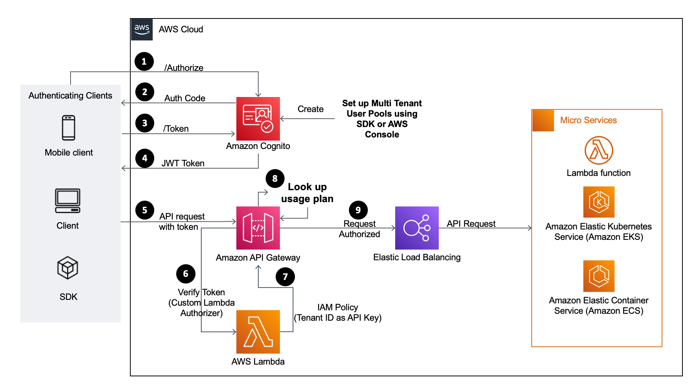
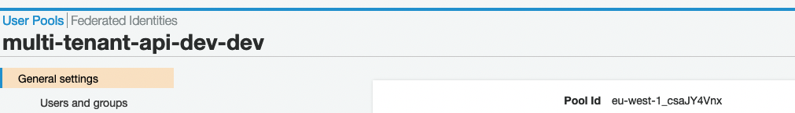
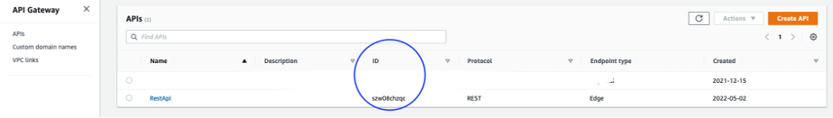
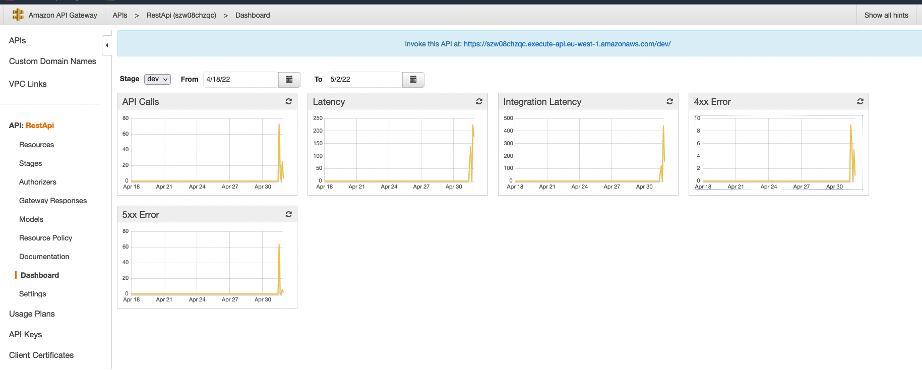

<h1 align="center">
Amazon Api Gateway usage policy based api protection
 
   
   
</h1>

This blog post looks at how to protect and monetize multi-tenant APIs using Amazon [API Gateway](https://docs.aws.amazon.com/apigateway/latest/developerguide/welcome.html). It describes a multi-tenant architecture design pattern based on [a custom tenant ID](https://docs.aws.amazon.com/cognito/latest/developerguide/custom-attribute-based-multi-tenancy.html) to onboard customers. A tenant in a multi-tenant platform represents the customer having a group of users with common access, but individuals having specific permissions to the platform.

### Architecture

Target architecture:

  

### Usage

#### Prerequisites
To deploy the solution,

1. [An AWS Account](https://signin.aws.amazon.com/signin?redirect_uri=https%3A%2F%2Fportal.aws.amazon.com%2Fbilling%2Fsignup%2Fresume&client_id=signup)
2. [An AWS Identity and Access Management (IAM) administrator access](http://aws.amazon.com/iam)
3. [The AWS Command Line Interface (AWS CLI)](https://docs.aws.amazon.com/cli/latest/userguide/getting-started-install.html)
4. [Install AWS CDK](https://docs.aws.amazon.com/cdk/v2/guide/getting_started.html)

#### Deploy the example

> **Note**
You are responsible for the cost of the AWS services used while running this sample deployment. There is no additional
cost for using this sample. For full details, see the pricing pages for each AWS service that you use in this sample. Prices are subject to change.

1. Clone the repository to your local machine.
    * `git clone https://github.com/aws-samples/api-gateway-usage-policy-based-api-protection`

2. Prepare the deployment package - The `cdk.json` file tells the CDK Toolkit how to execute your app.
    * `cdk synth`                                               emits the synthesized CloudFormation template
    * `npm run build`                                           compile typescript to js
    * `npm install --prefix aws-usage-policy-stack/lambda/src`  install npm packages

3. Configure the user pool in Amazon Cognito
    * `npx cdk deploy CognitoStack`     deploy Cognito stack
4.	Open AWS Console and select Amazon Cognito service. choose manage user pool and select your user pool. Note down pool id under general settings.

5.	Create a user with tenant id.

    * `aws cognito-idp admin-create-user --user-pool-id <REPLACE WITH COGNITO POOL ID> --username <REPLACE WITH USERNAME> \
    --user-attributes Name="given_name",Value="<REPLACE WITH FIRST NAME>" Name="family_name",Value="<REPLACE WITH LAST NAME>" " Name="custom:tenant_id",Value="<REPLACE WITH CUSTOMER ID>" \
    --temporary-password change1t`

6.	To simplify testing the OAuth flow, use https://openidconnect.net/. In the configuration, set the JWKS well known URI.
    * `https://cognito-idp.<REPLACE WITH AWS REGION>.amazonaws.com/<REPLACE WITH COGNITO POOL ID>/.well-known/openid-configuration`

7.	Test Oauth flow [open id connect](https://openidconnect.net/) using to get the JWT ID Token. Save the token in nodepad.

8.	Open aws-usage-policy-stack/app.ts in an IDE and replace “NOT_DEFINED” with 20 chars long tenant id from step 3 in Deploy Amazon Cognito Resources. 
9.	Configure user pool in Amazon API Gateway and upload Lambda
    * `npx cdk deploy ApigatewayStack`  deploy Api Gateway stack

10.	After successful deployment of API Gateway stack, open AWS console and select Amazon API Gateway. Locate ProductRestApi in name column and note down its id from id column as highlighted in below screen.

    

    
    

## Test the example

Test the example using the following curl command. It throttles the requests to the deployed API based on defined limits and quotas. The following thresholds are preset: API quota limit of 5 requests/day, throttle limit of 10 requests/second, and a burst limit of 2 requests/second. 

To simulate the scenario and start throttling requests.

1.	Open a terminal window.
2.	Install the curl utility if necessary.
3.	Run the following command six times after replacing placeholders with the correct values.

`curl -H "Authorization: Bearer <REPLACE WITH ID_TOKEN received in step 5 of Deploy Amazon Cognito Resources>" -X GET https://<REPLACE WITH REST API ID noted in step 3 of Deploy Amazon API Gateway resources>.execute-api.eu-west-1.amazonaws.com/dev/products.`

You receive the message {“message": "Limit Exceeded"} after you run the command for the sixth time. To repeat the tests, navigate to the API Gateway console. Change the quota limits in the usage plan and run the preceding command again. You can monitor HTTP/2 429 exceptions (Limit Exceeded) in API Gateway dashboard.

Any changes to usage plan limits do not need redeployment of the API in API Gateway. You can change limits dynamically. Changes take a few seconds to become effective.

### Clean up

To avoid incurring future charges, clean up the resources created. To delete the CDK stack, use the following command. Since there are multiple stacks, you must explicitly specify the name of the stacks.

    * cdk destroy CognitoStack ApigatewayStack

### Conclusion

This post covers the API Gateway usage plan feature to protect multi-tenant APIs from excessive request loads and also as a product offering that enforces customer specific usage quotas. 

To learn more about Amazon API Gateway, refer to [Amazon API Gateway documentation](https://docs.aws.amazon.com/apigateway/latest/developerguide/welcome.html).  

## Security
See [CONTRIBUTING](CONTRIBUTING.md#security-issue-notifications) for more information.

## License
This library is licensed under the MIT-0 License. See the LICENSE file.
